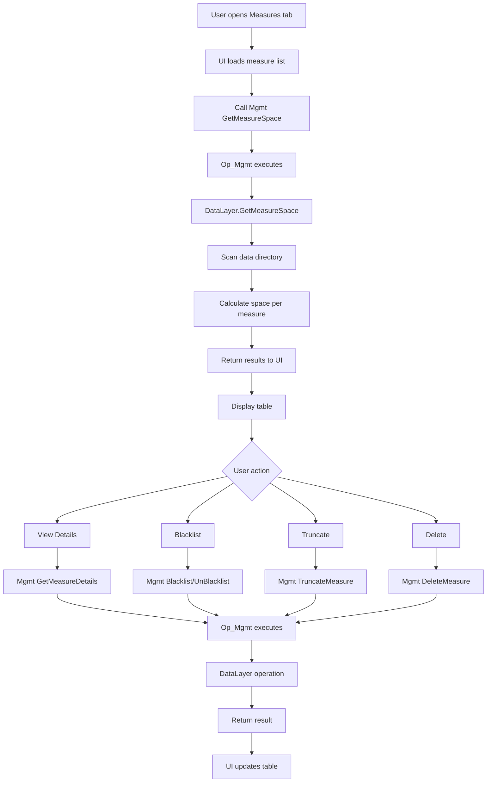

# Measure Management View - Technical Plan

## Overview

This plan describes the implementation of a new UI view and backend functionality for managing measures in the FKALA time-series database. The view will show space usage by measures and allow users to delete, truncate, or blacklist measures.

## Current State Analysis

### Existing Management Functions

The system currently supports these management commands via `/api/Mgmt` endpoint:

- `Mgmt LoadMeasures` - Lists all measurements
- `Mgmt FsChk` - Checks measurements for errors
- `Mgmt Copy` - Copies data between measurements
- `Mgmt Rename` - Renames a measurement
- `Mgmt Blacklist` - Blacklists a measurement (moves to blacklist directory)
- `Mgmt UnBlacklist` - Removes blacklist status
- `Mgmt Statistics` - Gets system statistics
- `Mgmt SortAllRaw` - Sorts raw files
- `Mgmt ImportInflux` - Imports InfluxDB data
- `Mgmt ImportMariaDbTstsfe` - Migrates MariaDB data
- `Mgmt BenchmarkIo` - Runs I/O benchmarks

### Current UI Structure

The UI (`FKala.Api/wwwroot/ui/index.html`) has:
- Single "Stream Query" tab with query input and output sections
- Navigation header with links to "Stream Query" and "Statistics"
- Table and raw stream output views
- Example queries including management examples

### Data Layer Capabilities

Key methods available in [`IDataLayer`](FKala.Core/Interfaces/IDataLayer.cs):
- `LoadMeasurementList()` - Returns list of all measurements
- `DeleteMeasurementAndMatViewDefinition(string)` - Deletes measurement directory
- `Blacklist(string)` / `UnBlacklist(string)` - Blacklist management
- `GetStatistics()` - System statistics
- `CopyFilesFromMeasurementToMeasurement()` - Copy data
- `MoveMeasurement()` - Rename/move measurement

## Proposed New Features

### 1. New Management Actions

Add to [`MgmtAction`](FKala.Core/Model/MgmtAction.cs) enum:

```csharp
public enum MgmtAction
{
    // ... existing actions ...
    GetMeasureSpace,      // NEW: Get space usage for measurements
    DeleteMeasure,        // NEW: Delete a measurement permanently
    TruncateMeasure,      // NEW: Remove all data from a measurement
    GetMeasureDetails     // NEW: Get detailed info about a measurement
}
```

### 2. New Backend Methods in IDataLayer

Add to [`IDataLayer`](FKala.Core/Interfaces/IDataLayer.cs):

```csharp
// Get space usage for all or specific measurements
IEnumerable<Dictionary<string, object>> GetMeasureSpace(string[]? measurements = null);

// Get detailed information about a measurement
IEnumerable<Dictionary<string, object>> GetMeasureDetails(string measurement);

// Truncate (remove all data from) a measurement
IEnumerable<Dictionary<string, object>> TruncateMeasure(string measurement);

// Delete measurement (already exists as DeleteMeasurementAndMatViewDefinition, needs wrapper)
IEnumerable<Dictionary<string, object>> DeleteMeasure(string measurement);
```

### 3. Implementation in Op_Mgmt

Extend [`Op_Mgmt.Execute()`](FKala.Core/KalaQl/Op_Mgmt.cs) to handle new actions:

```csharp
else if (MgmtAction == MgmtAction.GetMeasureSpace)
{
    var measurements = string.IsNullOrEmpty(Params) ? null : Params.Split(" ");
    context.Result = new KalaResult();
    context.Result.StreamResult = context.DataLayer.GetMeasureSpace(measurements);
    this.hasExecuted = true;
}
else if (MgmtAction == MgmtAction.DeleteMeasure)
{
    Params = Params.Trim('"');
    context.Result = new KalaResult();
    context.Result.StreamResult = context.DataLayer.DeleteMeasure(Params);
    this.hasExecuted = true;
}
else if (MgmtAction == MgmtAction.TruncateMeasure)
{
    Params = Params.Trim('"');
    context.Result = new KalaResult();
    context.Result.StreamResult = context.DataLayer.TruncateMeasure(Params);
    this.hasExecuted = true;
}
else if (MgmtAction == MgmtAction.GetMeasureDetails)
{
    Params = Params.Trim('"');
    context.Result = new KalaResult();
    context.Result.StreamResult = context.DataLayer.GetMeasureDetails(Params);
    this.hasExecuted = true;
}
```

### 4. New UI Tab - Measure Management

Create a new dedicated tab for measure management with the following sections:

#### UI Components

1. **Measure List Table**
   - Columns: Name, Data Points Count, Disk Space, First Data Point, Last Data Point, Status (Active/Blacklisted), Actions
   - Sortable columns
   - Filter/search functionality
   - Refresh button

2. **Action Buttons (per measure)**
   - View Details - Shows detailed information
   - Blacklist/UnBlacklist - Toggle blacklist status
   - Truncate - Remove all data (with confirmation)
   - Delete - Permanently delete (with strong confirmation)

3. **Bulk Actions**
   - Select multiple measures
   - Bulk blacklist/unblacklist
   - Bulk delete (with confirmation)

4. **Space Usage Summary**
   - Total disk space used
   - Top 10 largest measures
   - Space usage trend (if historical data available)

#### New Navigation Structure

```
Header Navigation:
- Stream Query (existing)
- Statistics (existing)
- Measures (NEW) ← Active tab for measure management
```

### 5. JavaScript Functions

Add to UI (`index.html` or new `measures.html`):

```javascript
// Fetch all measures with space info
async function loadMeasuresWithSpace() {
    const query = 'Mgmt GetMeasureSpace';
    await streamquery(urlInput.value, query);
}

// Get details for a specific measure
async function getMeasureDetails(measurementName) {
    const query = `Mgmt GetMeasureDetails "${measurementName}"`;
    // ...
}

// Delete a measure
async function deleteMeasure(measurementName) {
    const query = `Mgmt DeleteMeasure "${measurementName}"`;
    // ...
}

// Truncate a measure
async function truncateMeasure(measurementName) {
    const query = `Mgmt TruncateMeasure "${measurementName}"`;
    // ...
}

// Blacklist/Unblacklist
async function toggleBlacklist(measurementName, shouldBlacklist) {
    const action = shouldBlacklist ? 'Blacklist' : 'UnBlacklist';
    const query = `Mgmt ${action} "${measurementName}"`;
    // ...
}
```

## Implementation Steps

### Phase 1: Backend Extensions

1. **Extend MgmtAction enum** ([`MgmtAction.cs`](FKala.Core/Model/MgmtAction.cs))
   - Add `GetMeasureSpace`, `DeleteMeasure`, `TruncateMeasure`, `GetMeasureDetails`

2. **Extend IDataLayer interface** ([`IDataLayer.cs`](FKala.Core/Interfaces/IDataLayer.cs))
   - Add method signatures for new operations

3. **Implement in DataLayer_Readable_Caching_V1** ([`DataLayer_Readable_Caching_V1.cs`](FKala.Core/DataLayer/DataLayer_Readable_Caching_V1.cs))
   - `GetMeasureSpace()` - Calculate disk space per measure
   - `GetMeasureDetails()` - Get detailed info (datapoint count, time range, etc.)
   - `TruncateMeasure()` - Delete all data files
   - `DeleteMeasure()` - Wrapper for existing `DeleteMeasurementAndMatViewDefinition()`

4. **Update Op_Mgmt** ([`Op_Mgmt.cs`](FKala.Core/KalaQl/Op_Mgmt.cs))
   - Add handlers for new management actions

5. **Update MgmtParser** ([`MgmtParser.cs`](FKala.Core/KalaQl/QueryParser/MgmtParser.cs))
   - Add string conversion for new actions

### Phase 2: UI Development

1. **Create new UI tab structure**
   - Add "Measures" link to navigation
   - Create measures management section in `index.html` or create `measures.html`

2. **Implement measure list table**
   - Fetch and display measures with space info
   - Add sorting and filtering

3. **Implement action buttons**
   - Connect to backend management functions
   - Add confirmation dialogs for destructive actions

4. **Add bulk operations**
   - Checkbox selection
   - Bulk action buttons

### Phase 3: Testing & Documentation

1. **Test all new management commands**
   - Via HTTP endpoint directly
   - Via new UI

2. **Update documentation** ([`README_V2.md`](FKala.Api/README_V2.md))
   - Document new management commands
   - Add usage examples

## Data Flow Diagram



## API Examples

### Get Space Usage for All Measures

```bash
POST /api/Mgmt
Content-Type: text/plain

Mgmt GetMeasureSpace
```

Response:
```json
[
  {
    "measurement": "Sofar/measure/batteryInput1/SOC_Bat1",
    "diskSpaceBytes": 1048576,
    "diskSpaceMB": 1.0,
    "dataPoints": 50000,
    "firstDatapoint": "2024-01-01T00:00:00.0000000",
    "lastDatapoint": "2024-12-31T23:59:59.9999999",
    "fileCount": 365,
    "isBlacklisted": false
  }
]
```

### Get Details for Specific Measure

```bash
POST /api/Mgmt
Content-Type: text/plain

Mgmt GetMeasureDetails "Sofar/measure/batteryInput1/SOC_Bat1"
```

### Delete a Measure

```bash
POST /api/Mgmt
Content-Type: text/plain

Mgmt DeleteMeasure "Sofar/measure/batteryInput1/SOC_Bat1"
```

### Truncate a Measure

```bash
POST /api/Mgmt
Content-Type: text/plain

Mgmt TruncateMeasure "Sofar/measure/batteryInput1/SOC_Bat1"
```

## Security Considerations

1. **Confirmation Dialogs**: All destructive operations (delete, truncate) require explicit user confirmation
2. **Double Confirmation for Delete**: Delete should require typing the measure name to confirm
3. **Blacklist as Soft Delete**: Recommend blacklist over delete for safety
4. **Audit Logging**: Log all management operations for traceability

## Performance Considerations

1. **Lazy Loading**: Load measure details on-demand, not all at once
2. **Pagination**: For large measure lists, implement pagination
3. **Background Scanning**: Space calculation can be time-consuming; consider async/batch processing
4. **Caching**: Cache measure space info with periodic refresh

## Files to Modify

| File | Changes |
|------|---------|
| [`FKala.Core/Model/MgmtAction.cs`](FKala.Core/Model/MgmtAction.cs) | Add new enum values |
| [`FKala.Core/Interfaces/IDataLayer.cs`](FKala.Core/Interfaces/IDataLayer.cs) | Add new method signatures |
| [`FKala.Core/DataLayer/DataLayer_Readable_Caching_V1.cs`](FKala.Core/DataLayer/DataLayer_Readable_Caching_V1.cs) | Implement new methods |
| [`FKala.Core/KalaQl/Op_Mgmt.cs`](FKala.Core/KalaQl/Op_Mgmt.cs) | Add new action handlers |
| [`FKala.Core/KalaQl/QueryParser/MgmtParser.cs`](FKala.Core/KalaQl/QueryParser/MgmtParser.cs) | Add action string conversion |
| [`FKala.Api/wwwroot/ui/index.html`](FKala.Api/wwwroot/ui/index.html) | Add new UI tab and JavaScript |
| [`FKala.Api/README_V2.md`](FKala.Api/README_V2.md) | Document new commands |

## Conclusion

This plan provides a comprehensive approach to adding measure management capabilities to FKALA. The implementation follows existing patterns in the codebase and extends them logically. The UI will provide an intuitive interface for administrators to monitor and manage measures, with appropriate safeguards for destructive operations.
